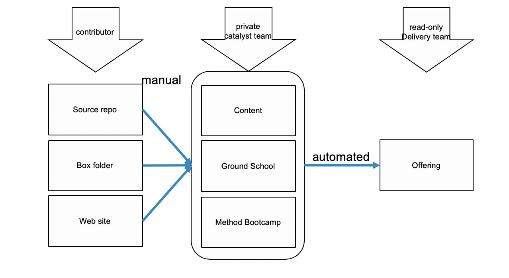

:toc:
= Proposed IBM Cloud Academy GIT structure

This repo is my test for structuring the GIT repo that we have.

== Repository structure

Proposed structure is that we maintain 2 levels of repositories. 

- The private one that we build our contents and collaterals. This can be one or many, however the split is based on how much overlap of the content existed. I envision one of them is an evolution of our current `content` repository. However, other repo such as the Ground School or IBM Innovate should apply too.

- The public one, which contain our *finished* offerings and products will be readonly most of the time. Updates will be performed by update to the offering MD and this *should* trigger a pull from the appropriate content repo which will build the PDFs and other deliverables as needed from the private layer. Some partner (int/ext) can fork this repo for their own modification.

The input to the private repositories are various repositories maintained by other entities (source repo) or presentations that we curated into our BOX folder. These input repo can include the content in the repo that were forked from the public offering repo.

== Content structure

Content format for the read-only repo for the team can be divided into:

* Instructional text 
** Lab guide
** Course description
** Book
* Presentation
** Lecture (PPTX/ODP)
** Web Lecture (slidy/reveal) 

== Offering repo automation

The structure of the offering repo is:

----
+--+-- offerings --+-- offering1.md
   |               +-- offering2.md
   +-- course1 ----+-- courseOverview.pptx
   |               +-- instructor +-- presentation1
   |               |              +-- presentation2
   |               +-- student +-- pdf1, pdf2 ...
   +-- course2 ----+-- 
   
   
----

The automation should `watch` the offerings folder. Any changes would trigger the offering.md file to be parsed and re-create the course path. 
